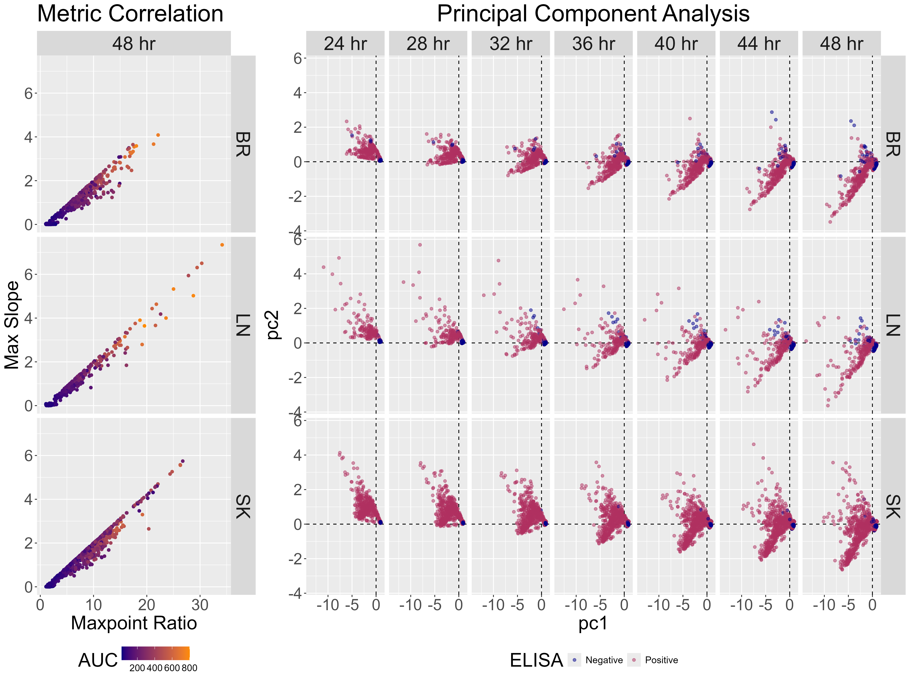
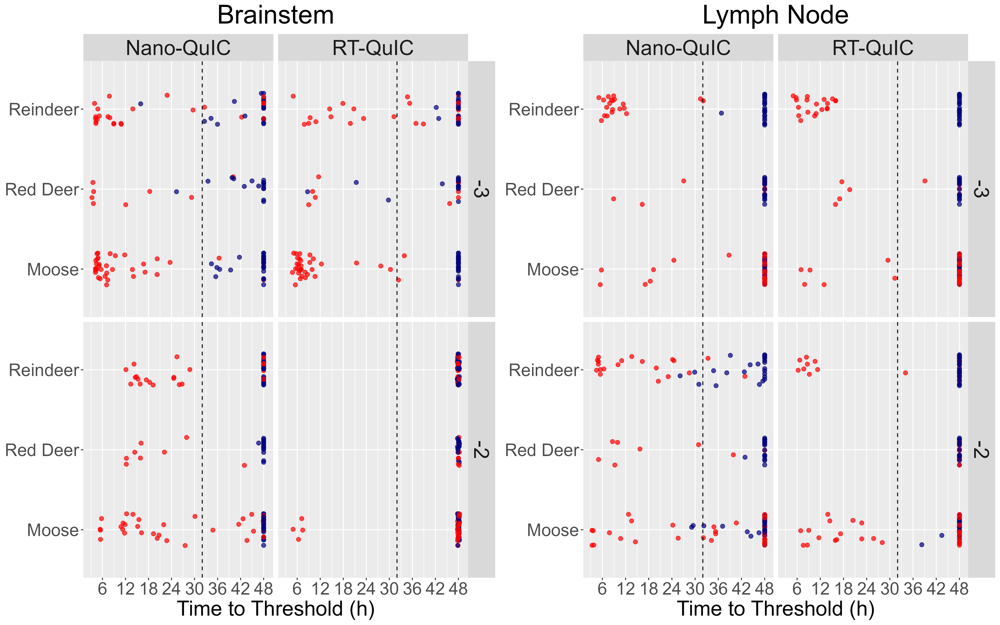
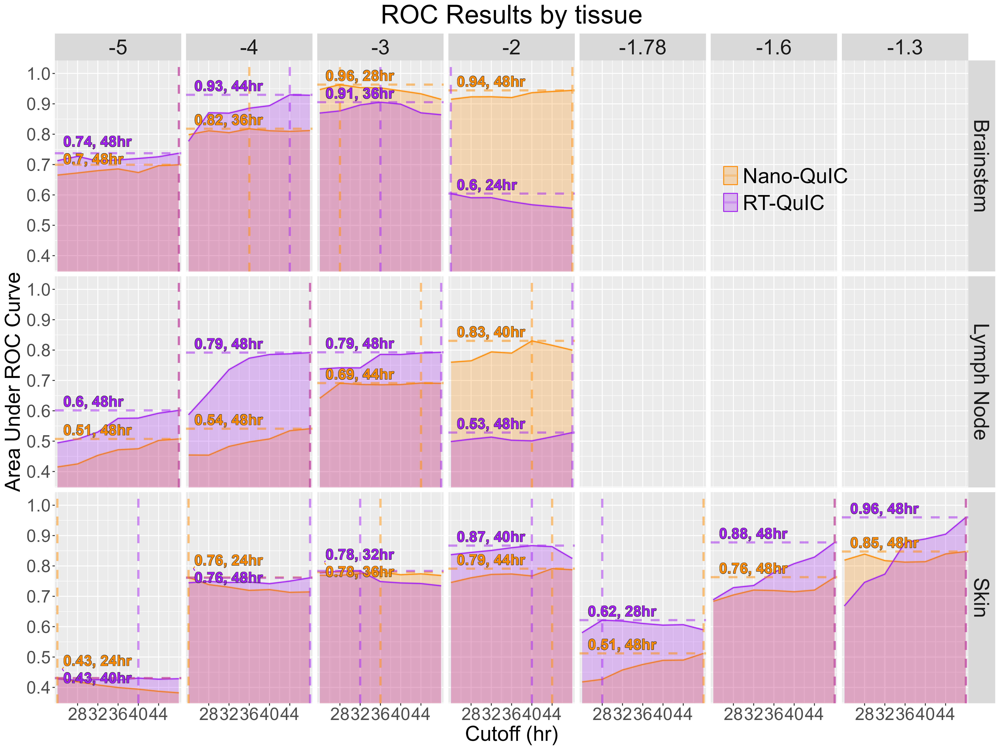

```{r setup}
library(tidyverse)
library(knitr)
library(kableExtra)
```

## Background

We compare two prion-detection assays — **RT-QuIC** and **Nano-QuIC** — across three Norwegian cervid species (moose, reindeer, red deer) and three tissues (brainstem, lymph node, skin). The goal is to identify, for each species/tissue combination, the **assay**, **sample dilution**, and **reaction time cutoff** that best discriminates ELISA-positive from ELISA-negative animals.

## Metric Reduction via PCA

Each QuIC reaction produces three correlated kinetic metrics:

- **MPR** — Maxpoint Ratio
- **MS** — Maxpoint Slope
- **AUC** — Area Under the fluorescence Curve

Because these metrics are highly collinear (see correlation plot below), choosing a single "best" metric for diagnosis would be arbitrary. Instead we run **principal component analysis** on the three metrics (scaled) and use **PC1** — which captures the dominant shared signal — as a unified diagnostic score for downstream ROC analysis.

```{r corr-pca, fig.cap="Left: pairwise correlation of MPR vs MS, colored by AUC, faceted by tissue (48 hr cutoff). Right: PC1 vs PC2 scores colored by ELISA status."}

```

### Time-to-Threshold Distributions
We observed that a clear separation in the times-to-threshold for each sample type, and so time-cutoffs were applied to the results starting at 24hr and ending at 48hr, incrementing by 4hr.

```{r ttt, fig.cap="Time-to-threshold (TtT) by species, faceted by assay (columns) and dilution (rows), for brainstem and lymph node tissues at the 48 hr cutoff. Dashed line marks the 32 hr which on average showed to be the most diagnostically consistent time cutoff for any given combination of tissue, assay, and dilution factor."}

```

## ROC Analysis

For every combination of species × tissue × assay × dilution × time cutoff, we compute an ROC curve using PC1 as the score and ELISA status as the truth label. We then identify the **top-performing** condition (highest AUC, earliest cutoff on ties) for each species/tissue/assay/dilution group.

```{r roc-combined, fig.cap="ROC curves for the top-AUC condition in each species/tissue/assay/dilution. (A) Moose, (B) Reindeer, (C) Red deer brain & lymph node; (D) Skin across species. Labels report time cutoff and AUC."}
include_graphics("figures/combined.png")
```

### AUC vs Cutoff by Tissue

To see how diagnostic performance evolves with reaction time, we average AUC across species at each cutoff:

```{r auc-by-cutoff, fig.cap="Mean area under the ROC curve across species as a function of reaction time cutoff, faceted by log dilution (rows) and tissue (columns)."}

```

## Recommended Conditions

### Best assay/dilution/cutoff per tissue (averaged across species)

```{r tissue-table}
read_csv("data/top_tissue_conditions.csv", show_col_types = FALSE) %>%
  mutate(
    Tissue = recode(Tissue, BR = "Brainstem", LN = "Lymph Node", skin = "Skin"),
    Assay = recode(Assay, NQ = "Nano-QuIC", RT = "RT-QuIC"),
    Dilutions = paste0("10^", round(Dilutions, 2), "^"),
    auc = round(auc, 3),
    cutoff = round(cutoff, 1)
  ) %>%
  arrange(Tissue, desc(auc)) %>%
  kable(
    col.names = c("Tissue", "Assay", "Dilution", "Mean AUC", "Cutoff (hr)"),
    caption = "Top-performing condition for each tissue/assay, averaged across species."
  ) %>%
  kable_styling(bootstrap_options = c("striped", "hover"), full_width = FALSE) %>%
  collapse_rows(1, valign = "middle")
```

### All top conditions per species/tissue (AUC > 0.7)

```{r top-all-table}
read_csv("data/top_all.csv", show_col_types = FALSE) %>%
  mutate(
    species = recode(species, M = "Moose", R = "Reindeer", RD = "Red Deer"),
    Tissue = recode(Tissue, BR = "Brainstem", LN = "Lymph Node", skin = "Skin"),
    auc = round(auc, 3)
  ) %>%
  kable(
    col.names = c("Species", "Tissue", "Assay", "Dilution", "Cutoff (hr)", "AUC"),
    caption = "All species × tissue × assay × dilution combinations with AUC > 0.7, sorted by performance."
  ) %>%
  kable_styling(bootstrap_options = c("none"), full_width = FALSE) %>%
  collapse_rows(1:3, valign = "middle")
```

## Takeaways

- **Brainstem** is the most diagnostic tissue overall, with multiple conditions reaching AUC = 1.0 across all three species.
- **Nano-QuIC** consistently performs at lower (more concentrated) dilutions and shorter cutoffs than RT-QuIC, suggesting faster turnaround on positive samples.
- **Lymph node** discriminates well in reindeer (AUC = 1.0 for both assays at 10^-3^) but is more variable in moose and red deer.
- **Skin** ROC analysis (pooled across species at the 10^-1.3^ dilution) is dominated by RT-QuIC at 48 hr (AUC = 0.96).
- Using **PC1** as the diagnostic score sidesteps the need to commit to a single kinetic metric and produces stable, interpretable ROC results across the experimental grid.

## Applying the Cutoffs
```{r Apply cutoffs, echo=FALSE, warning=FALSE, message=FALSE}
library(ggpubr)
top_conditions <- read.csv("data/top_conditions.csv") %>%
  # mutate(Dilutions = as.numeric(as.character(Dilutions))) %>%
  slice_max(Dilutions, by = c(species, Tissue, Assay))

all_aucs <- read.csv("data/aucs.csv")
# mutate(Dilutions = as.numeric(str_remove(Dilutions, "10\\^")))
# slice_max(Dilutions, by = c(species, Tissue, Assay))


df_pca <- read.csv("data/pca.csv") %>%
  mutate(
    # Dilutions = as.numeric(as.character(Dilutions)),
    Tissue = ifelse(str_detect(Tissue, "SK"), "skin", Tissue),
    RAF = ifelse(crossed, RAF, 0)
  )


df_top <- df_pca %>%
  right_join(top_conditions)
# right_join(select(top_conditions, -Dilutions))

df_all_aucs <- df_pca %>%
  right_join(all_aucs)

# All
df_top %>%
  # filter(Tissue == "BR" & Dilutions > -6) %>%
  ggplot(aes(ELISA, RAF, fill = Assay, color = Assay)) +
  # geom_point(alpha=0.5, size=1.2, position=position_jitter(0.1))  +
  geom_boxplot(aes(outlier.color = ELISA), color = "black") +
  # stat_compare_means(label.y.npc = 0.9)+
  # stat_compare_means(aes(label = after_stat(p.signif)),
  #                   method = "wilcox.test", label.y = 5, size = 7) +
  # facet_grid(rows=vars(Tissue)) +

  facet_grid(rows = vars(Tissue), cols = (vars(species))) +
  geom_label(aes(y = 0.3, label = paste0("Cutoff = ", cutoff, "\nDilution = ", round(Dilutions, 2), "\nAUC = ", round(auc, 3))), fill = "white", color = "black", inherit.aes = TRUE) +
  scale_y_continuous(limits = c(0, 0.4)) +
  labs(
    title = "Comparisons of RAF at Optimal Conditions"
  )

df_rect <- expand.grid(
  Tissue = sort(unique(all_aucs$Tissue)),
  Dilutions = sort(unique(all_aucs$Dilutions))
) %>%
  mutate(
    w_next = abs((Dilutions - lag(Dilutions)) / 2),
    w_prev = abs((Dilutions - lead(Dilutions)) / 2),
    dmin = Dilutions - w_next,
    dmax = Dilutions + w_prev,
    dmin = ifelse(is.na(dmin), Dilutions - w_prev, dmin),
    dmax = ifelse(is.na(dmax), Dilutions + w_next, dmax),
    .by = Tissue
  )

all_aucs %>%
  summarize(
    auc = mean(auc),
    .by = c(Dilutions, Assay, Tissue, cutoff)
  ) %>%
  left_join(df_rect) %>%
  ggplot(aes(Dilutions, cutoff, z = auc, fill = auc, group = auc)) +
  geom_rect(aes(xmin = dmin, xmax = dmax, ymin = cutoff, ymax = cutoff + 4)) +
  # geom_bin_2d(breaks = list(bins_x, bins_y), center=0.5) +
  # geom_text(aes(label = round(auc, 2)), color="white", hjust=0, vjust=0) +
  # geom_count() +
  # geom_line() +
  facet_grid(Tissue ~ Assay) +
  scale_fill_gradient2(low = "red", mid = "lightgreen", high = "navy", midpoint = mean(all_aucs$auc)) +
  scale_y_continuous(breaks = seq(24, 48, 4))
```
